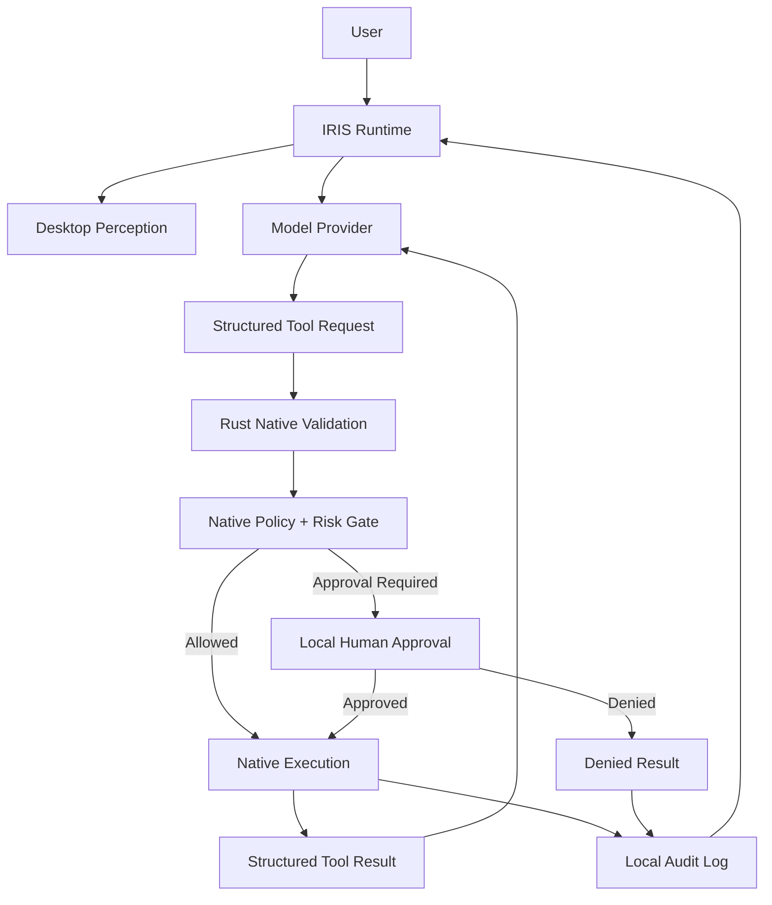

# IRIS

**An open-source runtime for AI agents that can see, reason, and act on a computer.**

IRIS is a local Tauri desktop application that connects desktop perception, model reasoning, structured tools, native computer control, policy enforcement, human approval, and local auditability. It is intended for developers who want to inspect, modify, and run a real desktop-agent runtime on their own machine.

IRIS is not presented as perfectly secure or fully autonomous. Model output is treated as untrusted input, risky actions are gated, and remote control is disabled in v0.2.0.

Created by Solstice AI Studio.

## Visual identity

IRIS is represented by the procedural reactive particle sphere in `src/components/IrisParticles.tsx`. The sphere responds to idle, listening, thinking, speaking/delivering, success, and error states; microphone input and IRIS speech output independently affect its color, motion, rotation, and deformation. It requires no imported 3D model and IRIS does not ship a selectable character identity.

## What is included

- React/TypeScript desktop interface in a Tauri shell
- Rust native runtime for screen capture, monitor awareness, windows, input, clipboard, applications, workspaces, macros, and local state
- A model-provider boundary with a deterministic offline mock and configurable OpenAI-compatible HTTP provider
- Structured tool schemas, argument validation, risk metadata, approval gates, and local audit records
- Local browser speech recognition/synthesis where the host browser supports it
- Local workspaces, macro storage, annotations, and history

The application does not require a Solstice-hosted service. Email, calendar, hosted memory, cloud relay, mobile companion control, and arbitrary shell execution are outside the v0.2.0 boundary.

## Capability Foundry

When IRIS encounters a web system it does not have a tool for, Capability Foundry can inspect an explicitly authorized origin and compile machine-readable surfaces such as OpenAPI, Swagger, GraphQL introspection, forms, or imported network observations into a governed declarative capability package. Candidates include schemas, evidence fingerprints, network scope, risk, tests, and approval requirements. Nothing is installed until reviewed locally, and installed capabilities execute through the same Rust policy boundary as built-in tools. A single MCP-compatible STDIO host exposes approved packages without opening a listener or generating arbitrary server code.

Synthesized capability does not imply synthesized authority: a package cannot install itself, grant credentials, broaden its origin, lower risk, overwrite built-ins, or bypass native approval. Authenticated execution remains disabled until OS-protected credential storage is configured; there is no plaintext fallback. See [docs/CAPABILITY_FOUNDRY.md](docs/CAPABILITY_FOUNDRY.md) and [docs/ARACHNE_EXTRACTION.md](docs/ARACHNE_EXTRACTION.md).

## Architecture



## Quickstart

### Prerequisites

- Windows 10/11 is the supported v0.2.0 platform
- macOS and Linux are experimental/not yet supported because several native capabilities are Windows-specific
- Node.js 20 or newer and npm
- Rust 1.77.2 or newer with the platform prerequisites listed in the [Tauri prerequisites guide](https://v2.tauri.app/start/prerequisites/)
- WebView2 and the Windows native build prerequisites required by Tauri

Clone the repository and install the frontend dependencies:

```bash
git clone https://github.com/Solasticeaistudio/iris-desktop-oss.git
cd iris-desktop-oss
npm install
```

Copy `.env.example` to `.env`, then choose `mock` for an offline run or configure an OpenAI-compatible provider. Start the desktop application:

```bash
npm run tauri:dev
```

Useful validation commands:

```bash
npm run build
npm test
cd src-tauri
cargo test
cargo fmt --check
```

On Windows PowerShell, the equivalent clean start is:

```powershell
Copy-Item .env.example .env
npm install
npm run tauri:dev
```

## Model configuration

The default provider is offline and deterministic:

```env
IRIS_MODEL_PROVIDER=mock
IRIS_API_KEY=
IRIS_BASE_URL=https://example.com/v1
IRIS_MODEL=your-model
```

For an OpenAI-compatible server, set:

```env
IRIS_MODEL_PROVIDER=openai-compatible
IRIS_API_KEY=your-api-key
IRIS_BASE_URL=https://example.com/v1
IRIS_MODEL=your-model
```

`IRIS_BASE_URL`, `IRIS_MODEL`, and `IRIS_API_KEY` are loaded together by the Rust runtime. The renderer cannot supply or replace the destination that receives the credential. Credentialed remote endpoints require HTTPS; explicit `http://localhost:<port>` and `http://127.0.0.1:<port>` endpoints are allowed for local inference. Redirects are disabled for provider requests so authorization headers cannot cross origins. Never commit `.env` or place credentials in documentation, tests, or screenshots.

See [docs/PROVIDERS.md](docs/PROVIDERS.md) for the provider contract.

## Safety defaults

Basic reversible desktop actions require a native, user-authorized computer-control session lasting at most 120 seconds. Before approval, IRIS resolves and displays the exact target window. Every input action revalidates its HWND, owning PID, executable identity, and foreground status; mouse coordinates must remain inside the approved window. A different application requires a new authorization, and existing terminal/shell windows are ineligible targets. The session can be cancelled and cannot authorize sensitive reads or high/critical tools. Sensitive reads and high/critical actions require a separate native one-request approval that expires after 90 seconds, is bound to the tool and normalized arguments, and is consumed once. Clipboard polling is disabled. Arbitrary file and clipboard reads require exact-action approval. Renderer code and model output are not trusted to authorize destructive native work. Computer control is temporary and bound to a specific application window; direct destructive, sensitive, and privileged IRIS capabilities remain separately gated. Because applications can expose powerful functionality through their own interfaces, users should review the target and purpose before granting GUI control.

MediaPipe presence detection uses JavaScript and WASM from the same exactly pinned `@mediapipe/tasks-vision` package. `npm ci` prepares the package's WASM files locally under `public/mediapipe/wasm`; IRIS does not fetch MediaPipe runtime code from a CDN. Face and hand task models are still fetched from the narrowly allowed `storage.googleapis.com` origin when presence detection is used.

Tool results are returned to the provider in a bounded loop. IRIS allows at most 8 tool rounds, 4 calls per provider response, 3 consecutive tool failures, and 120 seconds per request before stopping with a terminal explanation.

See [SECURITY.md](SECURITY.md), [docs/SECURITY_MODEL.md](docs/SECURITY_MODEL.md), and [docs/THREAT_MODEL.md](docs/THREAT_MODEL.md).

## Development

The tool registry is in `src/lib/toolRegistry.ts`; Capability Foundry lives in `src/lib/capabilityFoundry` and `src-tauri/src/capability_foundry`; the provider boundary is in `src/lib/modelProvider.ts`; native commands and validation live in `src-tauri/src/lib.rs`. Read [docs/TOOLS.md](docs/TOOLS.md), [docs/ARCHITECTURE.md](docs/ARCHITECTURE.md), [docs/CAPABILITY_FOUNDRY.md](docs/CAPABILITY_FOUNDRY.md), and [CONTRIBUTING.md](CONTRIBUTING.md) before adding capabilities.

## License and trademarks

IRIS is released under the Apache License 2.0. The license does not grant permission to use the IRIS or Solstice names, logos, or marks to impersonate an official distribution. See [NOTICE](NOTICE) for the short trademark notice.
